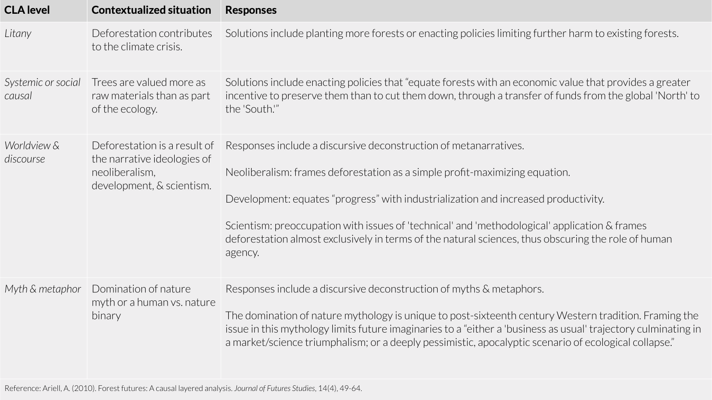
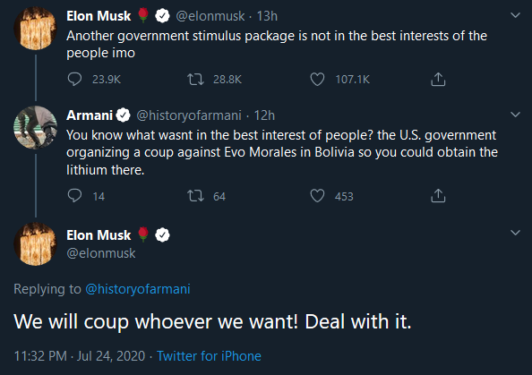

## A post climate-crisis world?

For a graduate project on climate change, I interviewed Matt Remle,[^1] a Lakota leader who is guiding the Green New Deal resolution in Seattle (a.k.a. traditional Duwamish and Coast Salish lands).[^2] During the interview, I asked, “Suppose we live in a world in which we’ve ‘beat’ climate change, what does that look like to you?”

His answer was simple:

> “To me, it would just simply be living the way we were meant to be living, which is in coexistence with one another."

Throughout the interview, he spoke about the values that get passed down through Lakota origin stories. Most notably, he mentioned the moral imperative of being a good relative—not just to other people but also to other animals, plants, and the land. 

## Causal layered analysis (CLA)

Causal layered analysis (CLA) is a qualitative methodology first developed by Inayatullah in 2004 for futures research and more recently adapted to contextualize and deconstruct complex social issues such as wicked problems.[^3] [^4] [^5] CLA provides a way for researchers to understand these issues at various levels of complexity, thus allowing researchers to hold space for multiple perspectives and unpack the root of the problem.

The four levels of CLA are summarized as follows:

1. Litany consists of the literal, visible, uncontested truths. Issues are quantifiable, but underlying assumptions are rarely questioned, and lack of coherence can result in perceived helplessness or apathy.

2. Systemic, or social causal - consists of social, technological, economic, environmental, political, and historical factors. Issues are based on interpretations of quantifiable data.

3. Worldview & discourse - consists of social, linguistic, and cultural processes that support and legitimizes it. Sublevels include stakeholder, ideological, civilizational, and epistemic levels.

4. Myth & metaphor - consists of the deep, emotive, often unconscious, and collective cultural archetypes. 

## A CLA of the UN’s deforestation policies

One of the most well-known symptoms is deforestation, and environmentalists claim that the solution is as simple as planting more trees. A causal layered analysis of the UN’s deforestation policies unpacks why this is not sufficient.

The Reducing Emissions from Deforestation and Forest Degradation (REDD) initiative from the United Nations Framework Convention on Climate Change (UNFCCC) supports “developing countries in reducing emissions from deforestation and forest degradation.”[^6] In 2010, Ariell conducted a causal layered analysis to deconstruct the frameworks that inform the REDD initiative, which is summarized in the table below.[^7]

<small><em>A summary of Ariell's 2010 causal layered analysis of deforestation policies</em></small>

No layer of analysis is assumed to be superior or inferior to the others. Each layer is addressed through different methods and by different groups. As Inayatullah notes,

> “Litany interventions lead to short-term solutions, easy to grasp, packed with data. Systemic answers require interventions by efficiency experts. Governmental policies linked to a partnership with the private sector often results. Worldview change is much harder and longer-term. It requires seeking solutions from outside the framework in which the solution has been defined. And myth solutions require deepest interventions, as this requires telling a new story, rewiring the brain and building new memories and the personal and collective body.”[^3]

In the context of the climate crisis, Americans need to take direct, immediate action in affecting policy change that addresses issues at the litany and systemic levels. However, to sustain the changes necessary to tackle a wicked problem, the climate crisis must also be framed at the worldview/discourse and myth/metaphor levels.

## Storytelling is revolutionary

The myth and metaphor layer is where stories hold their revolutionary power. In the United States, the predominant narrative is that of colonialism, specifically the white capitalist. In these stories, (wealthy white) people hold dominion over nature. People are different from land. People “own” land as property. People tame the wilderness and the wildebeests. People “win” land through violence. People exploit the land for profit. The same logic applies to Black and brown people and immigrants, whose labor can be exploited through slavery, prison labor, immigrant labor, and wage theft.

In the climate world, these narratives are used to justify injustice. Those who parrot these narratives suggest that the historical extractive capitalism of the fossil fuel industry was necessary to sustain modern life, or that the future extractive capitalism of lithium is necessary to build batteries for electric cars because they are the “solution” to climate change. This narrative applies to many other facets of climate change: the exploitation of garment workers in fast fashion, the exploitation of farm and factory workers for clean/vegan diets, and so on. 

<small><em>Elon's response to speculation that he was involved with Bolivian coup for lithium.</em></small>

In contrast, the Lakota peoples’ origin stories teach the moral imperative to care for the land as kin. Exploiting other people, living beings, or the land would be like exploiting a family member. The connection between a person and the land isn’t one of owner/property, it is a symbiotic familial relationship.

In his paper, Inayatullah writes:

> Finally, who generally solves the problem/issue also changes at each level. At the litany level, it is
usually others—the government or corporations. At the social level, it is often some partnership 
between different groups. At the worldview level, it is people or voluntary associations, and at the
myth/metaphor it is leaders or artists.[^3]

Those who benefit from the status quo will dismiss the importance of art and storytelling in favor of more “scoped” and easily quantifiable solutions which can only exist at the litany or systemic level. But don’t let that deter you, storytelling is a profound act of resistance, and it is revolutionary.

## References

[^1]: Matt Remle: [@wakiyan7](https://twitter.com/wakiyan7) and [lastrealindians.com](https://lastrealindians.com/).

[^2]: Seattle's Green New Deal [Resolution 31895](https://council.seattle.gov/2019/08/12/council-resolves-to-launch-seattles-green-new-deal/).

[^3]: Inayatullah, S. (2004). Causal layered analysis: Theory, historical context, and case studies. In The causal layered analysis reader: Theory and case studies of an integrative and transformative methodology (pp. 1-52). Tamkang University Press.

[^4]: Inayatullah, S. (2008). Six pillars: futures thinking for transforming. Foresight.

[^5]: Bishop, B. J., & Dzidic, P. L. (2014). Dealing with wicked problems: Conducting a causal layered analysis of complex social psychological issues. American Journal of Community Psychology, 53(1-2), 13-24.

[^6]: United Nations. (undated). “UN-REDD Programme.” UN-REDD website. Retrieved April 5, 2020. https://www.un-redd.org/.

[^7]: Ariell, A. (2010). Forest futures: A causal layered analysis. Journal of Futures Studies, 14(4), 49-64.
