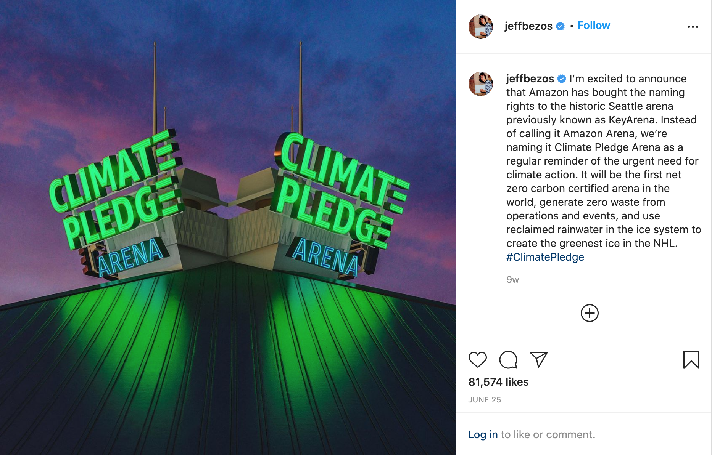

## Seeds of environmentalism

I didn't grow up with the same experiences as many Black and Indigenous environmentalists on the frontlines. I was incredibly privileged to grow up without severe health problems from a lack of clean air or water, and I haven't been displaced by climate change effects (yet?).

My entry point to environmentalism was my childhood love of science and space. I was fascinated by the idea of the greenhouse effect and the webs that connect life on Earth. I was fascinated by the sheer scale of it all. Plus, I hated hot weather.

I later moved to Santa Cruz, California, where I studied engineering in college. I spent years wandering among the redwoods between classes, going for night runs beneath a starry sky, watching full moons on the beach, celebrating with friends at the Monterey Bay Aquarium. I started hiking and kayaking. It was here that I began to immerse myself within the hippie outdoorsy/environmentalist culture—reusing water bottles, learning to reduce/reuse/recycle, taking public transit, dabbling with vegan and vegetarian diets. Santa Cruz taught me the reverence for nature to complement my love of science. 

<small><em>Santa Cruz, California, by <a href="https://unsplash.com/photos/WpNquk32Rm4">Simon Shim</a></em></small>

## Outgrowing performative environmentalism

By my early 20s, I was, by every measure, a performative environmentalist. I chided friends and family to invest in reusable water bottles, gave kudos to restaurants that used washable cloth napkins over disposable ones, and tried low/zero waste products. I walked and took public transportation, and planned on saving up for a Tesla for the times I do need to drive (before I realized that Elon Musk is a complete tool).

I also criticized the car-centric and consumerist suburban lifestyle and touched on other systemic issues, but I primarily focused on individual actions and lifestyle changes for a long time. When a friend explained that the straw ban in Seattle would do nothing, I thought, "well, there wouldn't be any harm, right?" After all, even if the effect is meaningless, the straw ban prompted me to reflect on my consumer habits. (I later learned about how the straw ban harms people living with disabilities.[^4])

The trite little lifestyle changes I made helped me dig deeper and start paying more attention to other environmental issues. My understanding of environmentalism evolved as I opened my eyes to more and more injustice. I finally started connecting the dots between the oppressive systems of neoliberalism, colonialism, and white supremacy. I still adopted a "yes-and" position when it came to individual action and addressing systemic injustice. I believed that it was possible to move from being a performative environmentalist to an intersectional environmentalist. That was the path I took, after all.

Then, I realized how virulently toxic it was to work with a performative environmentalist.

<small><em>Glass straws, by <a href="https://unsplash.com/photos/EU1R18L1Kb4">Giorgio Trovato</a></em></small>

## Gaslighting as a metaphor

Recycling was a public relations campaign by Big Oil and Big Soda.[^1] The concept of a "carbon footprint" was a public relations campaign by BP.[^2] I read about these PR campaigns for a graduate school project on climate and jokingly (not-so-jokingly?) commented to a trusted teammate that gaslighting is the best metaphor for the climate movement *(because gas, ha ha)*.

It took me a few more weeks to fully recognize that our other teammate (a "<a class="annotation">climate karen

  While the "karen" meme can be useful in encapsulating the entitled, privileged, antagonistic, racist, and self-victimizing behavior of white women, it is also important to name the specific behaviors and recognize that they are active upholders of white supremacy.
</a>" or "CK") was gaslighting us throughout the project. I wrote about this experience in a [previous post](/toxic-white-environmentalism/). CK was a particularly exemplary example of a performative white environmentalist: she loudly pushed individual actions towards fighting climate change and was so utterly intoxicated with her own perceived goodness that every minor disagreement caused her to lash out. My other teammates and I spent far more energy trying to put out and avoid CK's tantrums than we did working on our actual project. Even then, she spent the last two months intentionally trying to discredit us. CK's behavior wasn't just annoying, it was a textbook example of gaslighting,[^5] and it was horrifically draining.

## Green virtue signals are red flags

Reading [s.e. smith's fantastic essay on "performative environmentalism"](https://www.bitchmedia.org/article/personal-will-not-save-you-environmentalism) prompted me to think about the purpose of <a class="annotation">virtue signaling
  Virtue signaling or performative activism is used in social movements to describe actions from people who are more concerned with the <em>appearance</em> of caring about social justice in a public space where they can expect affirmation, e.g., a self-proclaimed "ally" who claims that they "stand for Black lives" but refuses to be held accountable for the harm they have done due to their own internalized white supremacy.
</a>.[^3] Why do people and organizations perform virtue? When does it become toxic?

*Hint: It's public relations and marketing.*

Big Oil and Big Soda started the recycling campaign to deflect blame and sell more plastic. BP started the carbon footprint campaign to deflect blame to individual consumers. CK loudly signaled her environmentalist credentials to avoid accountability, shut down dissent, and gain affirmation and praise. This deflection serves another purpose as well: to stifle the creativity needed to imagine new ways of living. The climate crisis is a big issue that needs a big imagination.

Sometimes the most obnoxious green virtue signals are giant red flags. Perhaps trite individual actions aren't inherently wrong if we can keep things in perspective. But I'm wary of people and organizations who scream their virtues because that's a sign of a desperate need to *look* good and avoid taking responsibility. I'll be holding on to my Santa Cruz hippie habits, and I'll also be staying far away from the performative environmentalists—they have an astonishing lack of creativity, anyway.

<small><em><a href="https://theneedling.com/2020/06/25/climate-pledge-arena-sign-removed-after-speaking-out-about-climate-change/">Are you fucking kidding me.</a></em></small>

## References

[^1]: [How Big Oil and Big Soda kept a global environmental calamity a secret for decades](https://www.rollingstone.com/culture/culture-features/plastic-problem-recycling-myth-big-oil-950957/) — Tim Dickinson, Rolling Stone

[^2]: [The carbon footprint sham](https://mashable.com/feature/carbon-footprint-pr-campaign-sham/) — Mark Kaufman, Mashable

[^3]: [The personal will not save you](https://www.bitchmedia.org/article/personal-will-not-save-you-environmentalism) — s.e. smith, Bitch Media

[^4]: [Banning straws might be a win for environmentalists. But it ignores us disabled people.](https://www.vox.com/first-person/2018/7/19/17587676/straws-plastic-ban-disability) — s.e. smith, Vox

[^5]: [Gaslighting at work – when you think you are going crazy](https://www.linkedin.com/pulse/gaslighting-work-when-you-think-going-crazy-samantha-young) — Samantha Young