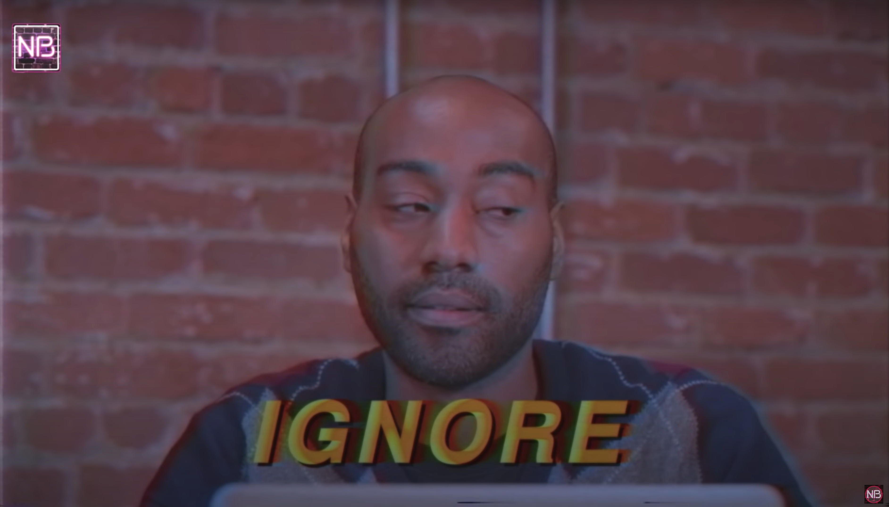

> “I have almost reached the regrettable conclusion that the Negro’s great stumbling block in his stride toward freedom is not the White Citizen’s Counciler or the Ku Klux Klanner, but the white moderate, who is more devoted to “order” than to justice; who prefers a negative peace which is the absence of tension to a positive peace which is the presence of justice…” — [Martin Luther King, Jr. (1963)](https://www.africa.upenn.edu/Articles_Gen/Letter_Birmingham.html)

## Beware the climate <a class="annotation">karens While the "karen" meme can be useful in encapsulating the entitled, privileged, antagonistic, racist, and self-victimizing behavior of white women, it is also important to name the specific behaviors and recognize that they are active upholders of white supremacy.</a>

The mainstream climate movement tends to frame climate change as a global issue, though it is frontline communities who bear the brunt of <a class="annotation">climate effects.
  The harmful effects of climate change and environmental degredation are numerous and include direct effects such as harmful air and water pollution, loss of food sources, loss of land, etc., as well as indirect social effects such as climate aparthied, hunger, poverty, disease, and violence.</a>[^1]
In the United States, Black and Indigenous communities are disproportionately affected by climate issues. Outside of the U.S., the <a class="annotation">Global South
  The "Global South" is an emerging term used to describe newly industrialized or "poorer" countries that are (or have a history of being) colonized by the wealthier "Global North."
</a> pays for the privileged lifestyles of the <a class="annotation">Global North
  The "Global North" is the complementary term to the "Global South," normally correlated with the "Western" or "First/Second" world and includes the U.S., Canada, most of the European countries, Japan, South Korea, and others.
</a>.

While climate change continues to be deeply polarized among party lines[^2] and has a stronger association with the Democratic party, the mainstream climate movement is also overwhelmingly white,[^3] making it a bastion for <a class="annotation">performative
  A term used in social movements to describe people who are more concerned with the <em>appearance</em> of caring about social justice in a public space where they can expect affirmation, e.g., a self-proclaimed "ally" who claims that they "stand for Black lives" but refuses to be held accountable for the harm they have done due to their own internalized white supremacy.
</a>, white environmentalists.

These white environmentalists constantly exclude, silence, and speak over voices from the front lines.[^4] On an institutional and individual level, the rampant racial gaslighting from white environmentalists makes the mainstream climate movement incredibly toxic for <a class="annotation">BIPOC
  I use the BIPOC acronym as an umbrella term for <em>"Black, Indigenous, and people of color"</em> to reference our shared experiences with whiteness and white supremacy which can include, but is not limited to both overt and covert racism, colorism, xenophobia, colonization, and genocide.
</a> environmentalists.

The white environmentalist’s danger is that they’re more deceitful and hypocritical.[^5] Climate-deniers are easy to spot, but white environmentalists act as <a class="annotation">racial narcissists,
  Narcissism describes a behavior pattern (and mental disorder in the case of NPD) in which people have a grandiose sense of self-importance and entitlement. The parallels between white supremacy and narcissism has been explored by many Black academics and other psychologists and sociologists such as Arianne E. Miller, Angelique Davis, and Ramani Durvasula.
</a>[^6] virtue-signaling to gain tokenized BIPOC environmentalists’ trust.

## A personal anecdote

For a recent project, I attended an anti-racism workshop with a white environmentalist I was working with. That white environmentalist walked out of the workshop and spent the next 3 months lambasting environmental justice movement for being too “divisive,” not focusing on enough “solutions,” and not centering the “social safety” of “moderates” like herself. She also explicitly “scoped” her solution to exclude racial issues, exemplifying white narcissism by centering her feelings above the actual lives of those in the frontline communities. For months, she used white tears, self-victimization, and blatant lies and gaslighting to evade any form of accountability and self-reflection. In addition, being in a predominantly white institution meant that all the authority figures automatically believed her white tears with zero evidence, despite me having documented proof on 5 months of her abusive behavior. Both the white environmentalist and her enablers continually dismissed my request for boundaries.

In environmentalism, these behaviors aren’t just annoying, they are intentionally weaponized to silence and gaslight other people, often BIPOC, who try to bring attention and wisdom to the most immediate, pressing issues which threaten the lives of frontline communities. In doing so, white environmentalists are willingly upholding the systems of white supremacy.

## Towards an intersectional environmentalism

To survive toxic white environmentalism, understand what <a class="annotation">white tears
  White tears are weaponized by (usually) white women in racialized settings to self-victimize themselves and paint the other person, normally BIPOC, as an aggressor. See: Carolyn Bryant or Amy Cooper
</a> are.[^7] [^8] Familiarize yourself with the <a class="annotation">DARVO technique
  DARVO (Deny, Attack, Reverse Victim and Offender) describes a common psychological tactic of abusers. This is similar to "always the hero/victim, never the villain."
</a>,[^9] 7 Circles of Whiteness,[^10] and racial gaslighting and narcissism[^6] [^11] so you can quickly recognize the red flags and walk away. Ensure that you have genuine allies by your side. Remember that the “performatively woke person takes up a lot of space while the ally makes space.”[^12] [^13] And remember that even the most critical institutions may not protect you.[^14] [^15] Toxic white environmentalists are simply another form of white moderates.

<small>
(From “<a href="https://www.youtube.com/watch?v=ZPDpcYEdiOg">White Fragility In The Workplace</a>”)
</small>

Until someone invents a way to harness the boundless energy of a white woman’s tears, BIPOC environmentalists should seek out climate justice or intersectional environmentalist spaces where their voice will be heard and honored. After my project, I joined a long lineage of BIPOC environmentalists[^16] that grew irredeemably frustrated with the mainstream climate movement. In the process, I also recognized how Black and Indigenous environmentalists had led the climate movement (among other movements) for decades.[^17] Stand your ground when the climate chads and karens try to gaslight you, the revolution will be intersectional.

## Climate resources for BIPOC

- [Intersectional Environmentalist](https://www.intersectionalenvironmentalist.com/) — Resources for intersectional environmentalism.
- [Front and Centered](https://frontandcentered.org/) — Washington state coalition of climate justice-focused organizations.
- [Got Green Seattle](https://gotgreenseattle.org/) — South Seattle-based organization based on environmental, racial, and economic justice
- [Green Voices of Color](https://twitter.com/i/lists/1087490564977819648) — A curated list by [@MaryHeglar](https://twitter.com/MaryHeglar)
- [50 Black Voices in the Green Space](https://www.instagram.com/p/CBOthLgncU_/?igshid=1p7sp5rdnwg5x) — A curated list by [@alluviamag](https://www.instagram.com/alluviamag/)
- [A survival guide for Black, Indigenous, and other women of color in academe](https://www.chronicle.com/article/a-survival-guide-for-black-indigenous-and-other-women-of-color-in-academe)

## References

[^1]: [People of color experience climate grief more deeply than white people](https://www.vice.com/en_us/article/v7ggqx/people-of-color-experience-climate-grief-more-deeply-than-white-people) — Nylah Burton, VICE

[^2]: [The politics of climate](https://www.pewresearch.org/science/2016/10/04/the-politics-of-climate/) — Pew Research Center

[^3]: [The state of diversity in environmental organizations](https://orgs.law.harvard.edu/els/files/2014/02/FullReport_Green2.0_FINALReducedSize.pdf) — Dorceta E. Taylor, Ph.D., University of Michigan

[^4]: [The climate movement's silence](https://heated.world/p/the-climate-movements-silence) — Emily Atkin

[^5]: [1963 speech](https://www.digitalhistory.uh.edu/disp_textbook.cfm?smtid=3&psid=3619) — Malcolm X

[^6]: [The roles of gaslighting and narcissism in racism](https://www.youtube.com/watch?v=4aZKNck6LDE) — Dr. Ramani (Video)

[^7]: [Amy Cooper knew exactly what she was doing](https://www.huffpost.com/entry/amy-cooper-knew-exactly-what-she-was-doing_n_5ecd1d89c5b6c1f281e0fbc5) — Zeba Blay, HuffPost

[^8]: [How white women use strategic tears to silence women of colour](https://www.theguardian.com/commentisfree/2018/may/08/how-white-women-use-strategic-tears-to-avoid-accountability) — Ruby Hamad, The Guardian

[^9]: [DARVO example](https://www.instagram.com/p/CBAAOX3HN7c/) — Rachel Elizabeth Cargle (Instagram image)

[^10]: [The 7 circles of whiteness](https://medium.com/@alishiamccullough/the-7-circles-of-whiteness-cb60e53d14e0) — Alishia McCullough M.S., LCMHCA, NCC

[^11]: [Racial gaslighting examples](https://www.instagram.com/p/CA82O3YlqUS/) — @ogorchukwuu (Instagram image) 

[^12]: [Performing wokeness](https://www.thecrimson.com/column/better-left-unsaid/article/2018/10/1/gray-performing-wokeness/) — Jenna M. Gray, The Harvard Crimson

[^13]: [On allyship and performative wokeness](https://medium.com/@Tawdry_Hepburn/on-allyship-and-performative-wokeness-30581808bf8b) — Eric Peterson

[^14]: [White Academia: Do Better.](https://medium.com/the-faculty/white-academia-do-better-fa96cede1fc5) — Jasmine Roberts, Ohio State University

[^15]: [White environmentalism and the coporate university](https://www.the-trouble.com/content/2020/4/27/white-environmentalism-and-the-corporate-university) — Roshan Krishnan, The Trouble

[^16]: [Why I quit being a climate activist](https://www.vice.com/en_us/article/g5x5ny/why-i-quit-being-a-climate-activist) — Karin Louise Hermes, VICE

[^17]: [Climate change isn’t the first existential threat](https://zora.medium.com/sorry-yall-but-climate-change-ain-t-the-first-existential-threat-b3c999267aa0) — Mary Annaïse Heglar, ZORA
