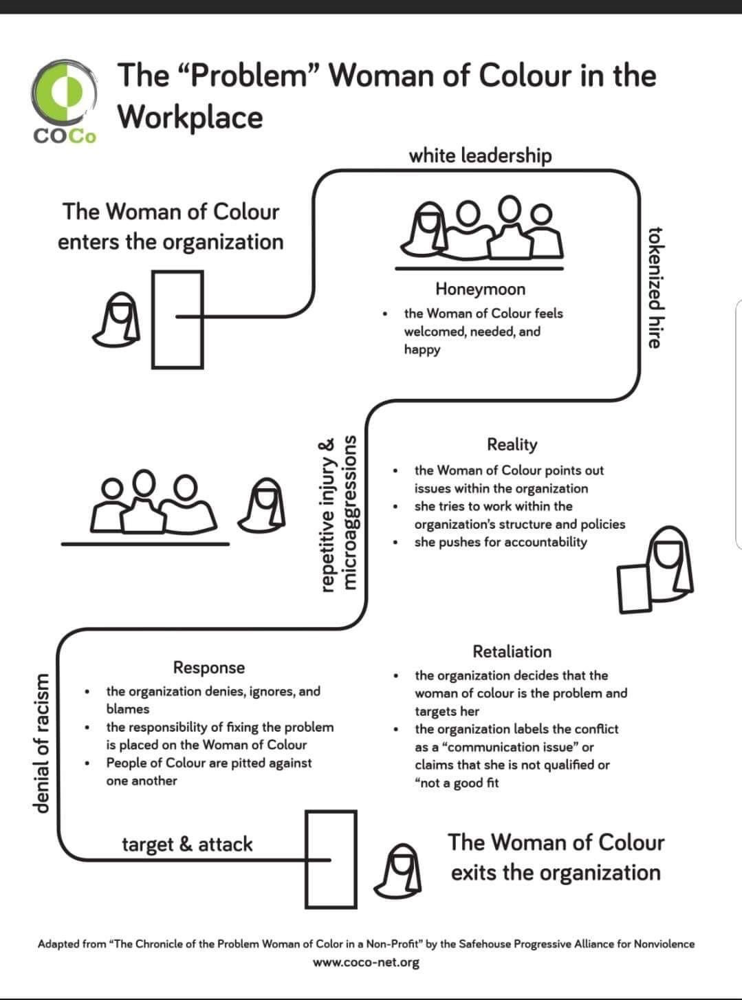
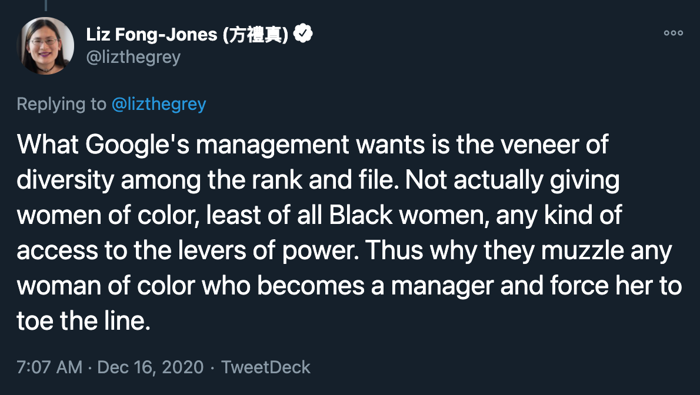

> “What I want to say is stop writing your documents because it doesn’t make a difference. The DEI OKRs that we don’t know where they come from (and are never met anyways), the random discussions, the “we need more mentorship” rather than “we need to stop the toxic environments that hinder us from progressing” the constant fighting and education at your cost, they don’t matter. Because there is zero accountability.”[^1]
> 
> “I wrote a billion documents, I had a billion meetings. They just tire you out. They meet with you over and over again. They feel good about themselves for meeting with you. They don’t do anything."[^2]
>
> — Dr. Timnit Gebru, on DEI efforts at Google

In December, the story of Jeff Dean’s retaliation against Dr. Timnit at Google made waves within tech circles.[^3] Aside from the blatant coporate censorship of the ethical concerns of AI (which could be [a series of posts on its own](https://www.nytimes.com/2020/06/09/technology/facial-recognition-software.html)), this story resonated with other Black technologists and other marginalized groups who recognize a toxic pattern that is all too familiar.

## The story of the “problem” woman of color & the self-proclaimed white “ally”

*(Note that Dr. Gebru’s experience is specifically that of a Black woman, for whom the consequences are most dire. Similar patterns of racial tokenization and retaliation happen to other women of color.)*

### The main characters

1. **The “problem” woman of color (WOC)** — A tokenized woman of color in a predominantly white, often male-dominated industry. The WOC starts out as a valued voice of diversity, but will get typecast with a racial stereotype (i.e., angry Black woman, spicy Latina, passive Asian or dragon lady, etc.).[^4][^5]

2. **The self-proclaimed white “ally” (SPWA)** — A white person who publicly professes their commitment to diversity and inclusion while their actions suggest otherwise.

3. **The enablers** — Other people within the organization (and often outside as well) who immediately accept the SPWA’s version of events while constantly questioning the WOC.

<small><em>A diagram of a common experience of racial discrimination towards "problem" women of color, by  <a href="https://coco-net.org/problem-woman-colour-nonprofit-organizations/">COCo</a></em></small>

## The story arc

### 1. The honeymoon

- Dr. Gebru joins Google and takes a seat at the proverbial table. Jeff Dean, Google’s head of AI, [publicly praises Dr. Gebru and professes his commitment to diversity](https://twitter.com/jingyingyang/status/1335012893859844098?s=20).

### 2. Reality

- Dr. Gebru and other co-authors submitted a paper detailing the dangers of large language processing models, which was potentially critical of a Google AI algorithm called BERT.

### 3. Response

- Dr. Gebru and other co-authors were told to retract the paper without any written feedback. Dr. Gebru responded with demands for accountability in this (extremely fuzzy) review process.
- Dr. Gebru, frustrated, vents to an internal “Google Brain Women and Allies” group, pointing out the lack of accountability in corporate DEI (diversity, equity, and inclusion) efforts.

### 4. Retaliation 

- Jeff Dean fires Dr. Gebru but falsely frames it as a resignation, despite an abundance of receipts from Dr. Gebru and her team proving that she did not resign.[^6]
- Jeff et. al.  doubles down on their smear campaign against Dr. Gebru, painting her as the “angry Black woman” citing behavior “inconsistent with the expectations of a Google manager” thus tearing down her credibility by shifting the focus on her tone and perceived professionalism. Throughout the next couple of days, they scramble to make up other reasons for Dr. Gebru’s [supposed resignation](https://twitter.com/EricaJoy/status/1335675515571617793?s=20).
- Jeff Dean and Megan Kacholia lead their own “conversation” about anti-racism. Notably, [they did not allow feedback](https://twitter.com/timnitGebru/status/1336340178542063622?s=20), allowing them to further control their narrative and image.

### 5. Continued enabling

*(This is a step I added from my own personal experience and from observing Dr. Gebru’s experience. Once Jeff Dean et. al. started the smear campaign, the enablers handled the rest.)*

- Other predominantly white people in tech uncritically accept Jeff Dean’s version of events while constantly questioning Dr. Gebru’s integrity. This is demonstrated in some of [the responses to Jeff Dean’s statement](https://twitter.com/kaulol/status/1334955329029885952?s=20), and even in [what appears to be a poorly astroturfed social media operation to further discredit Dr. Gebru](https://twitter.com/Mantzarlis/status/1337784486826831876?s=20).
- The enablers applaud the grandstanding displays of wokeness while refusing to listen to the person on the receiving end of Jeff Dean’s racist retaliation. People in positions in leadership who have the power to hold Jeff Dean accountable do nothing.

## When DEI efforts are just another marketing strategy

Justice in the tech industry (and at large) needs to be rooted far more deeply than public platitudes. Anti-racism isn’t *just* about whether we should capitalize the “b” in “Black” or pointing fingers at other white people and yelling “white fragility!” It *starts* by taking a critical look at our assumptions and reckoning with the role we all actively play in the grand machine of white supremacy.

If you want to learn to discern between someone genuinely committed to equity and justice, look beyond the black squares on Instagram or the #BlackLivesMatter preset banners on LinkedIn. Watch how the person responds (or reacts) when confronted with criticism and accountability.

Do they pause and try to grapple with their blind spots, especially if it is uncomfortable? Do they approach this new knowledge with humility and graciousness? Do they show gratitude to the people who have patiently tried to explain why something is unjust? Do they make genuine apologies? Do they actively take steps to correct the work they’ve done that excludes or harms marginalized communities?

Or do they react with temper tantrums and white tears? Do they dig in their heels and make excuses? Do they loudly profess their credentials (“woke” or otherwise) to puff their status while running smear campaigns to discredit the voices of the woman of color? Do they derail the “conversation” and force you to acknowledge and applaud their “good intent” before naming their impact? Do they blame everyone else, particularly the WOC, citing the tone or delivery of the feedback? Do they make false apologies, painting themselves as either the hero or the victim (but *never* the villain)? Do they dial-up their grandstanding, virtue signaling so loudly that it distracts from the fact that they have done absolutely nothing to correct the harmful work they’ve done?

Do they continue to do this for weeks, months, years, across different teams against multiple people (predominantly WOC)?

<small><em><a href="https://twitter.com/lizthegrey/status/1339225672783253504?s=20">A twitter thread from Liz Fong Jones (@lizthegrey)</a> outlining her experience as a trans woman of color who was formerly a manager at Google.</em></small>

## A glimmer of hope

When they behave like the latter, they demonstrate that they don't include diverse voices at their proverbial table out of goodwill or a commitment to justice. They do it to stroke their egos, maintain their veneer of inclusion, *and most importantly, keep their position of privilege and influence*. But if there's one part of Dr. Gebru's story that gives me a glimmer of hope, it's that the outpouring of outrage means that there are plenty of people who are no longer fooled by this false veneer.

## References

[^1]: [The withering email that got an ethical AI researcher fired at Google](https://www.platformer.news/p/the-withering-email-that-got-an-ethical) — Casey Newton, Platformer

[^2]: [Was This Google Ethicist Fired for Doing Her Job? (Transcript)](https://slate.com/transcripts/WHljaXNiT2xrU1VXYzBGeEN5THhjc24zajE1S3VCWmlOZGNEc0VqK1Bjcz0=) — NPR

[^3]: [Google hired Timnit Gebru to be an outspoken critic of unethical AI. Then she was fired for it.](https://www.washingtonpost.com/technology/2020/12/23/google-timnit-gebru-ai-ethics/) — Nitasha Tiku, Washington Post

[^4]: [Speaking Up As A Woman Of Color At Work](https://www.forbes.com/sites/ruchikatulshyan/2015/02/10/speaking-up-as-a-woman-of-color-at-work/?sh=4a8bbde62ea3) — Ruchika Tulshyan, Forbes

[^5]: [The Bamboo Glass Ceiling](https://slate.com/human-interest/2018/08/asian-american-women-face-a-glass-ceiling-and-a-bamboo-ceiling-at-work.html) — Tiffany Diane Tso, Slate

[^6]: [Setting the Record Straight #ISupportTimnit #BelieveBlackWomen](https://googlewalkout.medium.com/setting-the-record-straight-isupporttimnit-believeblackwomen-5d7bbfe4ed90) — Google Walkout For Real Change
